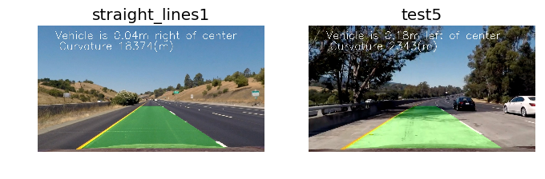

Advanced Lane Finding Project
=============================

The goals / steps of this project are the following:

* Compute the camera calibration matrix and distortion coefficients given a set of chessboard images.
* Apply a distortion correction to raw images.
* Use color transforms, gradients, etc., to create a thresholded binary image.
* Apply a perspective transform to rectify binary image ("birds-eye view").
* Detect lane pixels and fit to find the lane boundary.
* Determine the curvature of the lane and vehicle position with respect to center.
* Warp the detected lane boundaries back onto the original image.
* Output visual display of the lane boundaries and numerical estimation of lane curvature and vehicle position.

[//]: # (Image References)

[chessboard]: ./output_images/calibration2.jpg "chessboard"
[calibrate_result1]: ./output_images/calibration_double.png "chessboard calibrated"
[calibrate_result2]: ./output_images/calibration_double2.png "chessboard calibrated"
[example_1_undist]: ./output_images/straight_lines1_double.png "Road Transformed"
[example_2_undist]: ./output_images/test1_double.png "Road Transformed"
[example_1_binary]: ./output_images/straight_lines1_binary_double.png "Binary Example"
[example_2_undist]: ./output_images/test5_undistort.jpg "Road Transformed"
[example_2_binary]: ./output_images/test5_binary_double.png "Binary Example"
[test1_warp_example]: ./output_images/straight_lines1_transform_double.png "Warp Example"
[video1]: ./project_video_output.mp4 "Video"

## [Rubric](https://review.udacity.com/#!/rubrics/571/view) Points

### Here I will consider the rubric points individually and describe how I addressed each point in my implementation.  

---

### Writeup / README

You're reading it!

### Camera Calibration

#### 1. Briefly state how you computed the camera matrix and distortion coefficients. Provide an example of a distortion corrected calibration image.

The code for this step is contained in lines #16 through #44 of the file called `calibrate.py`.  

I start by preparing "object points", which will be the (x, y, z) coordinates of the chessboard corners in the world. Here I am assuming the chessboard is fixed on the (x, y) plane at z=0, such that the object points are the same for each calibration image.  Thus, `objp` is just a replicated array of coordinates, and `objpoints` will be appended with a copy of it every time I successfully detect all chessboard corners in a test image.  `imgpoints` will be appended with the (x, y) pixel position of each of the corners in the image plane with each successful chessboard detection.  

![corners on chessboard][chessboard]

I then used the output `objpoints` and `imgpoints` to compute the camera calibration and distortion coefficients using the `cv2.calibrateCamera()` function.  I applied this distortion correction to the test image using the `cv2.undistort()` function and obtained this results:

![calibration result][calibrate_result1]
![calibration result][calibrate_result2]

### Pipeline (single images)

#### 1. Provide an example of a distortion-corrected image.

The calibration parameters collected above with a chessboard were then applied to the real images. 
When applying `undisort()` (`transform.py` line 5 to 7 ) to this original images we will have the undistorted version. Unfortunately the effect cannot be seen well on the given example.

![alt text][example_1_undist]
![alt text][example_2_undist]

The changes can be best identified in the corners of the images and the hood of the car.

#### 2. Describe how (and identify where in your code) you used color transforms, gradients or other methods to create a thresholded binary image.  Provide an example of a binary image result.

I used a combination of different color channels to generate a binary image (thresholding steps at lines 13 through 46 in function `combined_thresh()` in file `transform.py`). I decided to use different color channels from different color spaces:

color space | channel  | which feature
------------|----------|-------------------
HLS         | s channel| detects most of yellow and white lanes
HLS         | l channel| detects shadows - this information is used to correct difficult parts of the images.
LUV         | l channel| detects all white lanes
LAB         | b channel| detects all yellow lanes

Here's an example of my output for this step.

![alt text][example_1_binary]

It can be seen that both yellow and white lanes are correctly identified.

A better result can be seen with a more difficult example which includes some shadows:

![alt text][example_2_binary]

It can be seen that although some parts of the yellow lane are occluded most of the lane can be identified.
Including gradient threshold did not gave significant improvements but lead to much more computing effort. The computing time for the example video was 25% faster when only using color thresholds.

#### 3. Describe how (and identify where in your code) you performed a perspective transform and provide an example of a transformed image.

The code for my perspective transform includes a function called `transform()`, which appears in lines 49 through 53 in the file `transform.py`.
The `warper()` function takes as inputs an image (`img`), as well as the transformation matrix. The matrix is created in line 28 of file `main.py` from source (`src`) and destination (`dst`) points. The inverse Matrix `M_inv` is created at the same time - it will be used in one of the last steps to transform back the images.

I chose hard coded source and destination points in the following manner (see `main.py` line 20 to 27):

| Source        | Destination   |
|:-------------:|:-------------:|
| 180, 700      | 200, 720      |
| 1150, 700     | 1080, 720     |
| 715, 460      | 1080, 0       |
| 570, 460      | 200, 0        |

I verified that my perspective transform was working as expected by drawing the `src` and `dst` points onto a test image and its warped counterpart to verify that the lines appear parallel in the warped image.

![warp example with lines][test1_warp_example]

#### 4. Describe how (and identify where in your code) you identified lane-line pixels and fit their positions with a polynomial?

I have created a distinct Lane class (file `Lane.py`) to avoid code duplication. Both left and right lanes inherit from this base class.

The pipeline for finding lanes is implemented in the function `Lane.find_lane_for_frame()` (line 105 of `Lane.py`). Right in the beginning of that function two main cases are distinguished:

1. We have not found any lanes yet - this applies for single images and highly distorted frames in a video.
2. We have found already lanes in previous images (of a video).

##### 1. Sliding window search

In the first case the function`find_lane_windowed()` will be used to make a full search for lanes without pre-knowledge. The function can be found in `Lane.py` from line 42.

I first compute the histogram of the image and find the maximum of the half I expect the lane (left half for left lanes, right half for right lanes). This is done in function `find_lane_windowed()` from line 43 to 52 of `Lane.py`.
The windowing approach follows pretty much the algorithm of the lecture - based on the initial midpoint of the half we're looking for non-zero pixels in a window. the mean of these non-zero pixels are getting used to
identify the position of the next window when a certain amount of pixels are found.
A result of this operation can be seen here:


##### 2. Finding lanes with pre-knowledge

The second option is that we already have a valid lane which can will be the basis for searching lane pixels.

The function `find_lane_with_preknowledge()` from line 36 in `Lane.py` computes
1. A line based on the average polynomial points
2. Candidate pixels for the new detected lane around that lane (within a marging of 100pixels).
3. returns an array of candidate pixels.

##### 3. Generate polynomial coefficients and compute new lane

Both functions (sliding window and pre-knowledge function) return candidates for a lane. By applying the numpy function `np.polyfit()` (line 122 in `Lane.py`) to those candidates I get a second order approximation of the detected lane. The coefficients returned by the polyfit function are stored in the Lane class in a double ended queue (prvided by `collections.deque()`) to be able to simply calculate the mean values of the coefficients over several frames.

The found lanes can be visualized by re-calculating the lane line from the (averaged) polyline coefficients resulting in


#### 5. Describe how (and identify where in your code) you calculated the radius of curvature of the lane and the position of the vehicle with respect to center.

The radius of the the curvature of the lane is computed as part of my Lane class in function `calculate_new_radius()` (line 96 of `Lane.py`). I used the function provided by the lecture:

```python
left_curverad = ((1 + (2*left_fit_cr[0]*y_eval*ym_per_pix + left_fit_cr[1])**2)**1.5) / np.absolute(2*left_fit_cr[0])
right_curverad = ((1 + (2*right_fit_cr[0]*y_eval*ym_per_pix + right_fit_cr[1])**2)**1.5) / np.absolute(2*right_fit_cr[0])
```

To have a smoother change of curvature values in the video output I used again a `collections.deque` container to have a mean value over several frames of a video.

The position of the vehicle was calculated by using the averaged position relative to the left and right lane:

```python
position = np.mean((right_line+left_line)/2)
distance_from_center = abs((640 - position)*3.7/700) 
```

#### 6. Provide an example image of your result plotted back down onto the road such that the lane area is identified clearly.

The last step - after identifying the lanes - is to warp back the lane printed lanes (see last image) and to add the original (undistorted) image with the plotted lane lines. In addition the polyine betwen the lanes gets marked.



It can be seen that in the `test5` image the shadow significantly influence the left lane line. However - the curvature is in the correct range. The averaging of polyline coefficients prevents that this error is seen in the final video output.

---

### Pipeline (video)

#### 1. Provide a link to your final video output.  Your pipeline should perform reasonably well on the entire project video (wobbly lines are ok but no catastrophic failures that would cause the car to drive off the road!).

My video pipeline is using the same functions as the plain image pipeline except some debug output and can be found in the function `pipeline_vid()` in line 171 of `main.py`. The final output can be found next to this writeup.

![video outuy][video1]

---

### Discussion

#### 1. Briefly discuss any problems / issues you faced in your implementation of this project.  Where will your pipeline likely fail?  What could you do to make it more robust?

My initial pipeline on images only performed quite good on the test images although the shadows were disturbing some of the lane detection thresholds. I minimized this by adding more color features to my thresholding. Nevertheless - using the initial pipeline on a video failed when crossing the first shadow / tarmac change. The crucial part was to introduce and tune temporal dependencies between the frames.

First approach was to completely drop frames where on of the lanes was not found. This somehow improved the quality but was still not optimal. By introducing a buffer for the polyline coefficients the video pipeline gave me very good results. The separate computation of the two lanes improved the robustness of the detection(only one lane gets dropped / recalculated).

However - applying my current approach to the challenge videos the result was rather bad. My current approach is very prone to brightness changes. Some points which might improve the robustness of the algorithm:

* Apply more pre-processing to the frames - i.e. normalize them.
* Use adaptive thresholds based on some statistics of the image
* Use the knowledge of the previous frame to adapt the statistics / adaptation of the thresholds.
* 